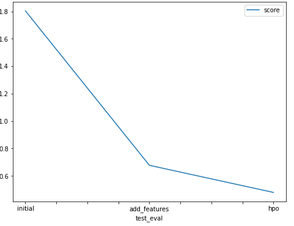

# Report: Predict Bike Sharing Demand with AutoGluon Solution
#### Clinton Chikwata

## Initial Training
### What did you realize when you tried to submit your predictions? What changes were needed to the output of the predictor to submit your results?
The initial phase of the training required to observe if there are 
any negative values in the prediction dataset before submitting. All values were positive,

### What was the top ranked model that performed?
The top most ranked model using the root mean square error metric is `WeightedEnsemble_L3`.

## Exploratory data analysis and feature creation
### What did the exploratory analysis find and how did you add additional features?
From plotting histograms at the exploratory data analysis (eda) step, I deduced that :

1. I noticed that the following some features  [temp, atemp, humidity, windspeed] were nearly distributed.
2. some features had only two possible values [holiday, working day]
3.some features were categorical such as [season, weather] it also seemed that although the data was
nearly uniformly distributed among the 4 seasons, most of the data had a certain weather category (1).
4 Followed the notebook instruction to add hour feature in dataset by deducing it from the datatime feature.

### How much better did your model preform after adding additional features and why do you think that is?
The best model's rmse decreased from 52.8 to 30.1 as a validation score which is a massive improvement.

This happened because the hour feature gives the trained models better information and intuition
about which hours in the day in general the bike share demand increases or decreases without specifying a certain year, 
month or day and according to the hour feature histogram 
it seems that the data was recorded nearly equally on all the hours of the day so the hour feature holds useful information.

## Hyper parameter tuning
### How much better did your model preform after trying different hyper parameters?
After performing hyperparameter optimization via a random search method using the data with the added hour feature,
the model's training rmse increased from 30.113174 to 33.760331 for the best model. However, 
the model's test error decreased from 0.67715 to 0.47948. 
I think this is because I focused on tree based models with boosting ensemble technique that performed best with the default settings mainly Gradient boosting,
CATboost and XGboost during hpo, 
while before hpo autogluon would try alot more types of models so it might have been slightly overfitting the data.

### If you were given more time with this dataset, where do you think you would spend more time?
Given more time I would spend more time doing future engineering as I noticed just a hour future had significant on the results of model.Afterwards
I would then devote more attention at the hyperparameters.

### Create a table with the models you ran, the hyperparameters modified, and the kaggle score.
|    | model        | hpo1                                                                                                                                                                                            | hpo2                                                                                                                                                                                 | hpo3                                                                                                                                                     |   score |
|---:|:-------------|:------------------------------------------------------------------------------------------------------------------------------------------------------------------------------------------------|:-------------------------------------------------------------------------------------------------------------------------------------------------------------------------------------|:---------------------------------------------------------------------------------------------------------------------------------------------------------|--------:|
|  0 | initial      | default_vals                                                                                                                                                                                    | default_vals                                                                                                                                                                         | default_vals                                                                                                                                             | 1.80412 |
|  1 | add_features | default_vals                                                                                                                                                                                    | default_vals                                                                                                                                                                         | default_vals                                                                                                                                             | 0.67715 |
|  2 | hpo          | GBM (Light gradient boosting) : num_boost_round: [lower=100, upper=500], num_leaves:[lower=6, upper=10], learning_rate:[lower=0.01, upper=0.3, log scale], applying random search with 5 trials | XGB (XGBoost): n_estimators : [lower=100, upper=500], max_depth : [lower=6, upper=10], eta (learning_rate) : [lower=0.01, upper=0.3, log scale] applying random search with 5 trials | CAT (CATBoost) : iterations : 100, depth : [lower=6, upper=10], learning_rate  : [lower=0.01, upper=0.3, log scale] applying random search with 5 trials | 0.47948 |

### Create a line plot showing the top model score for the three (or more) training runs during the project.

### Create a line plot showing the top kaggle score for the three (or more) prediction submissions during the project.

## Summary
In Summary, I think this exercise shows how important it is to perform explorative data analysis on any given data set.
This extends into future engineering which then provides the machine learning good set of data which provides good results.Additionaly hyperparameter is also a critical step 
that may be taken when you have done everything and you have obtained the results you want as the default parameters may not be able
to push the model to perform better.